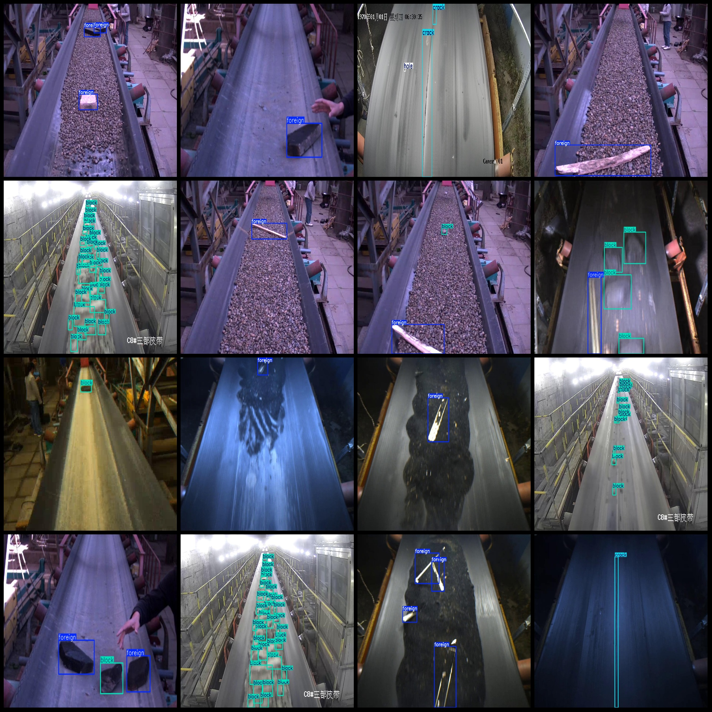
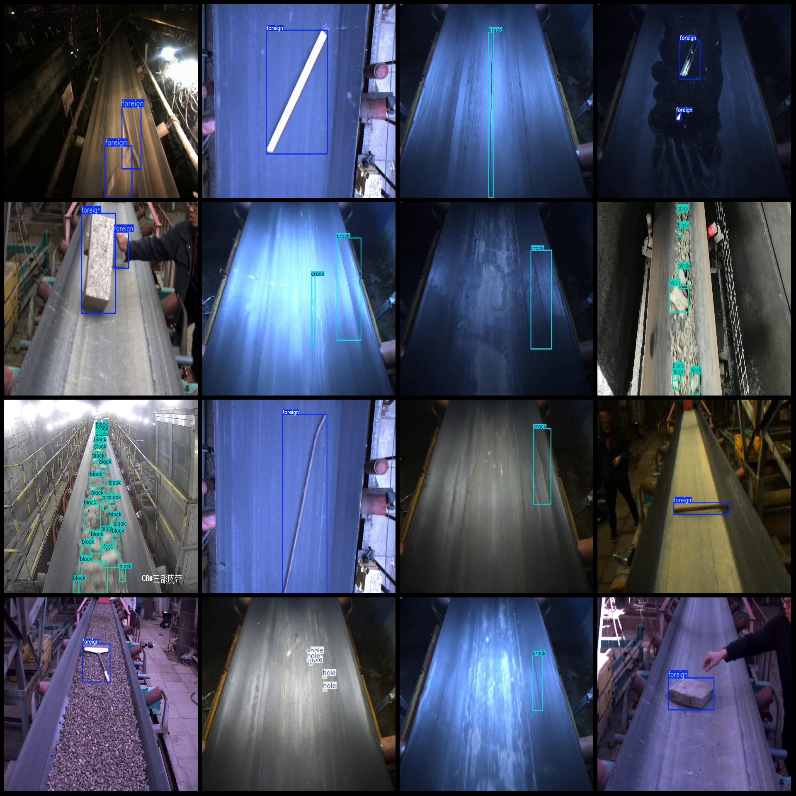

# Coal Mine Conveyor Belt Object Detection Dataset VOC+YOLO format with 1057 images in 4 categories

Dataset format: Pascal VOC format + YOLO format (txt file without split path, only containing jpg images and corresponding VOC format xml files and YOLO format txt files)

Number of images (jpg file count): 1057
Number of annotations (xml file count): 1057
Number of annotations (txt file count): 1057
Number of annotation categories: 4
Annotation category names (notice that the order in YOLO format is not consistent with this, but according to the labels folder classes.txt): ["block", "crack", "foreign", "hole"]

Box counts for each category:
- Block (block) box count = 5596
- Crack (crack) box count = 250
- Foreign (foreign) box count = 1180
- Hole (hole) box count = 219
Total box count: 7245

Number of pictures per category:
- Block (block) pictures = 371
- Crack (crack) pictures = 177
- Foreign (foreign) pictures = 668
- Hole (hole) pictures = 60

Image resolutions: Images with multiple resolutions, such as 2560x1440, 720x480, etc.

Annotation tool used: labelImg
Annotation rules: Drawing a square box around the category

Important note: The dataset does not have been divided into training, validation, or test sets; you will need to do so yourself.

Special declaration: This dataset does not guarantee any accuracy in the trained models or weight files.

Image preview:

Annotation example:
Image

Here is a pay link on Stripe ( https://buy.stripe.com/3cs8yP7sY87d0vu9AB ). Please contact me lonlonago@foxmail.com after funding $89, and I will send you a complete data files , thank you!

